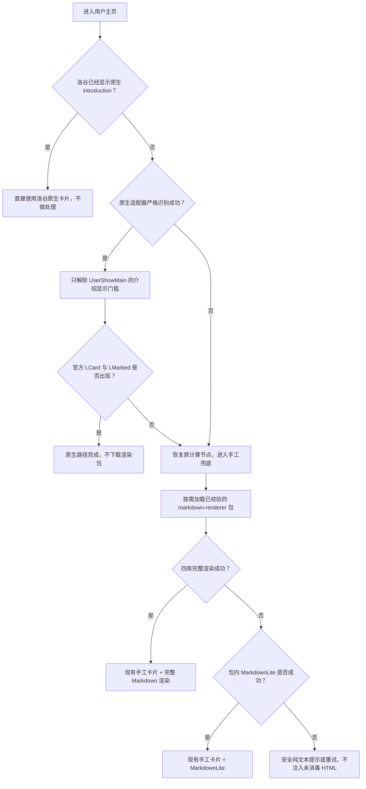

# hidden-intro 原生优先与按需渲染包迁移计划

> 状态：Phase 0-3 已完成；Phase 4 的源代码、自动化测试、主路径、失败后重试和 full-to-lite 真实浏览器验收已完成，备用镜像完整性仍待决策；Phase 5-7 未实施。
> 编写日期：2026-07-26  
> 当前基线：LuoguSP 2.13.4  
> 目标：`hidden-intro` 采用“洛谷原生组件优先、LuoguSP 现有手工方案兜底”，同时升级并迁移四个第三方 `@require` 为 LuoguSP CDN 上的独立按需渲染包。

## 实施记录（2026-07-27）

- Phase 0：已新增 MarkdownLite 的结构化 Markdown/XSS/占位符/长输入夹具，并保留当前 `@require` 渲染链路作为未发布基线。
- Phase 1：已建立版本化独立 renderer API、显式 Highlight.js 语言集、可重复 bundle 构建、release manifest schema v2 和 `optionalBundles.markdownRenderer` 描述；`renderer:check` 已确认四库不会进入启动 runtime。
- Phase 2：renderer stack 已锁定为 KaTeX 0.18.1、Marked 18.0.7、DOMPurify 3.4.12、Highlight.js 11.11.1；完整/轻量/XSS 回归通过，`npm audit --omit=dev` 为零漏洞。
- 2026-07-27 的 `2.13.5-canary.1 --dry-run` 生成 renderer 为 412,587 B、gzip 126,826 B，且未写入 release、channel 或生产用户脚本。
- Phase 3：已修复 `onNativeAttached` 生命周期接线，并增加 feature 级路由离开、SPA 用户切换、dispose、原生已显示不重复和识别锚点失败转兜底测试；原生 computed 的 restore 现在由 feature disposer 持有并执行。
- Phase 4：已拆出 `fallback-intro-controller.js`、`renderer-client.js` 和 `src/cdn/optional-bundle-loader.js`；renderer 仅在手工兜底挂载时下载，按固定 release 描述执行双域名尝试、SHA-256 校验、同页 Promise 复用、AbortSignal、API 版本校验、full-to-lite 和安全纯文本重试。
- runtime 构建现在固定注入当前 release 的 renderer 描述与两个自定义 origin；`2.13.5-canary.2 --dry-run` 生成 renderer 412,587 B、gzip 126,826 B，runtime 97,594 B，且未写入 release、channel 或生产用户脚本。
- 已生成独立身份、无自动更新地址的 `LuoguSP QA 2.13.5-canary.2`；canary URL 参数 `?luogusp-qa=native|fallback` 会通过 DOM `<meta id="luogusp-qa-hidden-intro">` 暴露只读状态，其中 `fallback` 仅在 prerelease runtime 强制原生适配失败。
- `2.13.5-canary.2` 已部署到 Cloudflare 自定义域名 `spcdn.betaoi.cc` 并通过全部不可变文件、字节、SHA-256、MIME、CORS 和缓存头验证；EdgeOne 因本机 token 失效未部署，`spcdn.betaoi.cn` 暂记 degraded。
- 冻结的 `2.13.4` release 中，`early-gate` manifest 声明的哈希文件名与实际字节 SHA-256 不一致；canary channel 已由后续 release 正确生成和推广，因此 `npm test` 不再受影响，但 `quality:check` 仍会如实报告这项不可变历史漂移，不得原地改写 2.13.4。
- 真实生产 bundle 复核确认当前洛谷为 Vue 3.5.35；`UserShowMain`、Suspense 分支、嵌套 computed 依赖和异步路由组件均已纳入严格遍历。适配器不再依赖匿名结构猜测，也不按压缩变量名或 bundle 哈希命中。
- `2.13.5-canary.3` 至 `.11` 用于逐步验证 CSP/GM 传输、Vue 应用就绪、异步组件发现、BFCache/SPA 返回和旧用户 DOM 竞态；失败版本均只用于 QA，没有推广到生产用户脚本。
- `2.13.5-canary.12` 起用组件树中的目标用户 UID、唯一 `UserShowMain` 和显示 gate 状态判断可见卡片归属，并在目标组件就绪且旧卡片退出后才挂接；这替代了不可靠的时间确认窗口。
- canary.13 已真实执行本人介绍的编辑、保存和原生重渲染：临时追加的 Markdown 成功保存后，243 字符原文被逐字符写回、二次保存并从服务器编辑器重新读回确认完全一致。
- canary.14-.15 暴露首屏异步覆盖和 page lifecycle 重建 feature 后实例状态丢失；canary.16 将最后路由保存在模块级 `WeakMap<Document, state>`，完整刷新使用新 Document，SPA/BFCache 重建仍能识别同文档旧路由。
- `npm test` 在 canary.17 源码上通过 131/131。除异步 Vue 根、Suspense、生产形态 computed、SPA/BFCache 和原生编辑态等回归外，新增了仅 prerelease 可识别的主源失败、整轮失败后重试和 full 失败转 lite 故障注入测试。
- canary.16 已发布到 `spcdn.betaoi.cc` 并通过 required-origin 生产校验；`spcdn.betaoi.cn` 仍是 optional degraded。QA 用户脚本 SHA-256 为 `2B4BC5F2F313C8E1B4622DC2DD796A4F8DC37871DF89F312601F95E6980F0B20`，生产 `LuoguSP.user.js` 未修改。
- canary.17 已发布到 `spcdn.betaoi.cc` 并通过 required-origin 生产校验，加入 `fallback-primary-fail`、`fallback-retry`、`fallback-lite` 三个受限 QA 模式；QA 用户脚本 SHA-256 为 `D52CFC844B5A3486B2838581C46D826684D6CFF57548A2EBBDF72A0E550AE9AC`，真实 Tampermonkey 验收已完成。

## 交接状态（2026-07-27）

### 已完成且可复用

- Phase 0-4 的 renderer 基线、独立 bundle、manifest v2、原生优先生命周期和按需手工兜底均保留在当前工作区；生产用户脚本及其六条启动期 `@require` 尚未切换。
- `src/features/hidden-intro/native-intro-adapter.js` 已实现严格的 Vue 3.5.x 原生适配器：只在恰有一个 `UserShowMain`、目标用户 introduction、唯一 false 显示 computed、身份依赖和渲染订阅者同时满足时才挂接；使用 `WeakMap` 保存原函数，并在失败、超时或身份快照变化时恢复。
- `src/features/hidden-intro/diagnostics.js` 已提供 `already-native`、`native-attached`、`native-unsupported`、`native-timeout` 及三种 fallback 状态；`createHiddenIntroFeature()` 以 `getDiagnostics()` 暴露只读测试入口，未向页面全局暴露 Vue 实例或第三方库。
- `feature.js` 已在获取 introduction 后、手工卡片之前调用原生适配器；原生失败会继续走现有手工路径，不会修改 `user.isAdmin`、当前用户 UID 或站点身份数据。
- `test/native-intro-adapter.test.mjs` 覆盖：成功挂接并恢复、多个候选拒绝、身份字段变化后恢复并拒绝。最近一次命令 `node --test test/native-intro-adapter.test.mjs test/release-contract.test.mjs` 已通过。
- 真实浏览器探索曾在 `/user/2` 上确认 Vue `3.5.35`、`UserShowMain` 和官方卡片生成路径可用；这只是开发探针证据，尚不是 Phase 7 所要求的 Tampermonkey QA 工件。

### Phase 3：完成

- `watchHiddenIntro()` 已将 `attachNative` 作为第四参数传给 `showHiddenIntro()`；路由改变或 feature dispose 会恢复被强制显示的 computed，并清除 LuoguSP 手工卡。
- `test/hidden-intro-feature.test.mjs` 已证明：离开用户页恢复、用户 2 → 用户 3 的 SPA 切换先恢复后挂接、feature dispose 恢复并清除卡片、`/user/3` 已有原生介绍时不获取也不重复，以及原生锚点失败时进入一次手工兜底。
- Tampermonkey canary.16 已在 `/user/2?luogusp-qa=native` 通过：只出现一张官方 `l-card`，标题为“个人介绍（仅国际站可见）”，没有 `.luogusp-intro-card`，renderer 加载数为 0。
- 通过页面菜单进入本人 `/user/116524` 后，状态为 `already-native`，保留一个“编辑”按钮，无手工卡；浏览器返回 `/user/2` 后重新达到 `native-attached`，没有旧卡或重复卡。
- 本人介绍已真实完成“备份原文 → 写入临时 Markdown → 保存并确认原生渲染 → 写回原文 → 再次保存 → 服务器回读逐字符一致”，没有修改其他个人资料。
- 原生整条往返路径无 LuoguSP/site warning 或 error、无遮罩残留；页面探针确认 canary.16，全程 renderer 加载数为 0。

### Phase 4：代码与可控故障路径完成，备用镜像待决策

- `fallback-intro-controller.js` 负责 introduction 获取、手工卡片所有权、复制按钮、安全失败提示和重试；`feature.js` 已不再读取 `window.marked`、`window.DOMPurify`、`window.katex` 或 `window.hljs`。
- `renderer-client.js` 只在手工卡挂载后请求 renderer，并消费包内 full/lite 数据 API；`optional-bundle-loader.js` 使用固定描述、两个自定义 origin、SHA-256、Blob ESM import、同页 Promise 单例、AbortSignal 和严格 API 版本拒绝，不使用 `eval` 或 `new Function`。
- QA/后续正式脚本的 `GM_xmlhttpRequest` 与 `@connect spcdn.betaoi.cc` 是当前跨 CSP、按字节下载并校验 renderer 的必要权限；`@connect spcdn.betaoi.cn` 只服务于既定双源容灾契约。若取消备用源，必须把 `.cn` origin、验证与故障转移测试一起移除，不能只删除 userscript 元数据。
- 自动化测试覆盖单例、取消、描述/API 不匹配、失败后重试、安全纯文本 UI、lite 降级状态和一次性手工渲染；既有 `fetchVerifiedAsset` 测试继续覆盖主域完整性失败后切备用域。
- canary.17 的故障注入严格限于带连字符的 prerelease release 和白名单 QA 查询值：`fallback-primary-fail` 只拒绝主源 renderer 请求，`fallback-retry` 只让首轮两个 origin 返回合成 503，`fallback-lite` 只让 full renderer 进入既有 MarkdownLite catch 路径；稳定版和未知查询值均不启用。
- `fallback-retry` 真实验收通过：首轮两个 origin 都返回注入的 503 时只出现一张安全提示卡，点击“重试渲染”后从 `spcdn.betaoi.cc` 恢复，renderer 加载数从 1 变为 2，没有重复卡或 warning/error。
- `fallback-lite` 真实验收通过：full renderer 注入失败后得到 `fallback-lite/full-render-failed`，通过 `GM_xmlhttpRequest` 从主源加载一次，输出 MarkdownLite 安全结构且没有可执行节点。
- canary.17 的 `native` 复核通过：一张官方原生卡、零手工卡、renderer 加载数 0，标题仍为“个人介绍（仅国际站可见）”，无 warning/error。
- `fallback-primary-fail` 证明 loader 会按顺序请求备用域，但 `spcdn.betaoi.cn` 返回的字节 SHA-256 与 canary.17 manifest 不一致；加载器正确拒绝不可信字节并显示安全重试界面。是否修复 `.cn` 或删除备用域契约必须在 Phase 5 前明确。
- Tampermonkey canary.16 已在 `/user/2?luogusp-qa=fallback` 通过：只出现一张受管手工卡，完整 renderer 通过 `GM_xmlhttpRequest` 从 `https://spcdn.betaoi.cc` 加载，探针为 `fallback-rendered`，同页加载数为 1。
- 从强制兜底页进入本人主页时无手工卡且保留“编辑”；浏览器返回后手工卡恢复，renderer 加载数仍为 1，证明同页单例没有重复下载或初始化。整条路径无 warning/error、无遮罩残留。
- 原生路径 0 次、正常兜底 1 次、双域失败后重试和 full-to-lite 的真实浏览器门槛均已满足。唯一未满足的是“主域失败后从 `.cn` 成功取得同一不可变字节”；原因已定位为备用镜像内容完整性漂移，不是 loader 控制流。

### 当前验证与已知阻断

```powershell
npm run renderer:test
npm run renderer:check
npm test
node scripts/cdn/build.mjs --version 2.13.5-canary.17
npm run qa:hidden-intro:stage -- --version 2.13.5-canary.17
node scripts/cdn/verify-production.mjs --qa --version 2.13.5-canary.17
```

- `npm test` 当前通过 131/131。canary channel 已由新 release 正确生成和推广，不再触发旧 canary 指针的哈希失败。
- `npm run quality:check` 还会发现冻结的 2.13.4 `early-gate` manifest 声明 `a087...`、本地不可变文件实际为 `5e06...` 的既有漂移；同样不得原地改写 2.13.4。
- canary.17 是独立 `LuoguSP QA` 身份，无自动更新地址；Cloudflare release、canary channel 和真实浏览器验收均已更新，但生产用户脚本仍保持原样。
- 不要在决定“修复 `.cn` 镜像并保留双源”或“移除 `.cn` 及其 `@connect`/origin/验证契约”前进入 Phase 5，也不要发布稳定版或删除四条第三方 `@require`。

### CDN retention 后续设计

- 2026-07-28 用户确认新策略：正式版暂时全部保留；canary 只保留当前测试版本，之前版本全部清除。
- 本地和 `spcdn.betaoi.cc` 已执行该策略：保留 5 个正式版与 `2.13.5-canary.17`，删除其余 16 个 canary release（270 个受 Git 管理文件）；重新部署后 Workers 扫描文件由 471 降至 122。
- 已逐一验证主域上 5 个正式版和 canary.17 的 `manifest.json` 返回 200，16 个旧 canary 路径返回 404。被删除内容仍可从 Git 历史恢复。
- `spcdn.betaoi.cn` 尚未完成清理：canary.1 仍返回真实 JSON，canary.2-.17 的路径均被 EdgeOne 387 字节 HTML 回退页伪装为 HTTP 200；这也是 canary.17 renderer 完整性验证失败的来源。2026-07-28 用当前 122 文件重新部署 EdgeOne 时被 `Invalid EDGEONE_PAGES_API_TOKEN` 阻断，必须更新登录凭据或移除该备用域契约。
- 后续每次发布新 canary 时，应在验收和 channel 切换完成后删除上一 canary，再重新部署；不得在新 canary 尚未通过 required-origin 校验前提前删除当前测试版本。
- 中期可把相同 renderer 和公共 chunk 迁移为 SHA-256 内容寻址的共享对象，由 release manifest 引用，减少每个 canary 的逻辑重复；该路径迁移需保持旧 release URL 可用。

## 1. 结论摘要

本计划建议分阶段完成，不能把“原生组件接入”“四库跨大版本升级”“移除四个 `@require`”“CDN 按需加载”一次性盲切。

最终运行链路应为：



正式方案必须同时满足：

- 不修改 `user.isAdmin`、当前用户身份或洛谷业务数据。
- 原生适配失败时必须“失败关闭”，不能猜测组件并修改未知响应式节点。
- 原生路径成功时不下载四库渲染包。
- 手工兜底保留现有卡片、复制按钮、代码高亮和 MarkdownLite 能力。
- 四个第三方库不再作为 Tampermonkey 启动期 `@require`。
- 每个 CDN 文件继续使用不可变版本路径、内容哈希和 SHA-256 校验。
- `npm run publish` 仍然是唯一正式发布入口，发布后仍须真实 Tampermonkey 浏览器 QA 才能提交和推送。

## 2. 当前事实与范围

### 2.1 当前 `@require`

2.13.4 的用户脚本共有六个 `@require`：

1. LuoguSP `early-gate`
2. KaTeX 0.16.11
3. Marked 4.3.0
4. DOMPurify 3.0.9
5. Highlight.js 11.11.1
6. LuoguSP `runtime`

其中四个第三方文件的当前预算合计为：

- 原始体积：473,733 B
- gzip 体积：143,935 B

它们目前全部在脚本启动时下载和执行，但源码检索显示，真正直接使用这四个全局对象的只有 `src/features/hidden-intro/feature.js`。

### 2.2 article 与 paste 不接入新渲染包

受限文章和剪贴板当前通过洛谷官方页面壳、官方数据结构和官方前端脚本完成渲染：

- article 使用 `lentille-context` 和 Columba 原生组件；
- paste 使用 `_feInjection` 和 LFE 原生组件；
- 顶栏、侧栏、主题、Markdown 和评论均由洛谷前端负责。

因此，本次按需渲染包的首个且唯一消费者是 `hidden-intro` 的手工兜底路径。不要为了“统一”而让 article/paste 再次依赖自有 Markdown 渲染器。

未来只有在 article/paste 新增明确的“原生壳完全失效后的手工只读模式”时，才考虑复用同一渲染包；该功能不属于本计划。

### 2.3 原生组件可行性验证结论

真实浏览器验证已确认：

- `/user/2` 的官方响应数据包含 `introduction`，国内页面默认不生成介绍卡片；
- 官方组件为 `UserShowMain`；
- 官方门槛等价于“国际站、本人主页、管理员三者之一”；
- 在不修改 `user.isAdmin` 的情况下，只让该介绍门槛重新计算为可见，官方 `LCard` 和 `LMarked` 会立即生成；
- 生成结果保留洛谷官方 `data-v-*` 作用域样式，标题为“个人介绍（仅国际站可见）”，Markdown 图片正常；
- 说明“使用真正原生组件”在当前洛谷前端上技术可行。

但该入口属于 Vue 私有运行时，不是洛谷公开 API，所以必须和现有方案组成双通道，而不能单独承担功能。

## 3. 目标架构

### 3.1 hidden-intro 内部拆分

建议把目前单文件职责拆成以下模块：

```text
src/features/hidden-intro/
├─ feature.js                  # 路由、生命周期和总编排
├─ native-intro-adapter.js     # 洛谷原生组件探测、挂接、恢复
├─ fallback-intro-controller.js# 获取 introduction、等待挂载点、手工卡片
├─ renderer-client.js          # 按需渲染包客户端和状态机
├─ style.js                    # 仅手工兜底需要的样式
└─ diagnostics.js             # 可测试的路径状态，不承载业务逻辑

src/rendering/
├─ markdown-renderer-entry.js  # 独立 CDN 包入口
├─ markdown-renderer-api.js    # API 版本和返回值契约
├─ markdown-full.js            # Marked + DOMPurify + KaTeX
├─ markdown-lite.js            # 从 hidden-intro 迁出的 MarkdownLite
└─ code-highlight.js           # Highlight.js 与语言注册

src/cdn/
└─ optional-bundle-loader.js   # 双域名下载、SHA-256 校验、单例和超时
```

`src/rendering/*` 不得被 `runtime-entry.js` 静态导入，否则 esbuild 会把四个库重新打进启动 runtime，失去按需加载意义。

### 3.2 原生适配器职责

`native-intro-adapter.js` 只负责以下动作：

1. 检查当前路由确实是用户主页。
2. 如果 `.introduction` 已存在，返回 `already-native`。
3. 定位 `#app.__vue_app__` 和当前 Vue 组件树。
4. 精确定位 `UserShowMain`。
5. 从该组件的响应式依赖中找到唯一符合预期结构的介绍显示计算节点。
6. 保存原始计算函数和依赖关系。
7. 仅修改这个计算节点，使介绍分支可见，并触发该节点重新计算。
8. 验证官方 `.l-card .introduction .lfe-marked` 已出现，且不带 `.luogusp-intro-card`。
9. 在路由离开、功能关闭或验证失败时恢复原计算函数。

严禁：

- 设置 `user.isAdmin = true`；
- 设置当前登录用户 UID；
- 把整个站点伪装成国际站；
- 替换 Vue、Router 或全局页面数据；
- 仅按压缩变量名、模块数字 ID 或某一个 bundle 哈希强行命中；
- 找到多个候选节点时任选一个。

### 3.3 原生适配的严格识别条件

适配器只有同时满足下列条件才允许运行：

- Vue 应用根存在且版本落在已验证范围；
- 页面组件树中恰好有一个 `UserShowMain`；
- 当前数据中的 `user.introduction` 为字符串且非空；
- 当前页面没有原生 `.introduction`；
- 候选计算节点恰好一个；
- 候选节点原始结果为 `false`；
- 候选节点依赖当前用户、自身 UID 或 `isAdmin`，并且其订阅者属于目标 `UserShowMain`；
- 修改后在限定时间内只新增一张官方介绍卡；
- `user.isAdmin`、用户 UID、当前登录用户等业务字段前后完全一致。

任何一条不满足就返回结构化失败原因并进入手工兜底。原生适配失败不应向普通用户输出红色错误；仅记录带 `LuoguSP hidden-intro native:` 前缀的诊断信息。

### 3.4 独立渲染包契约

建议使用一个稳定的小接口，避免 `hidden-intro` 继续直接访问 `window.marked` 等全局变量：

```js
export const apiVersion = 1;
export const dependencyVersions = Object.freeze({
  katex: "...",
  marked: "...",
  dompurify: "...",
  highlight: "...",
});

export function renderMarkdown(source, options) {
  // 返回 { html, mode: "full" | "lite", warnings: [] }
}

export function enhanceCodeBlocks(root, options) {
  // 高亮和语言 class 归一化；复制按钮仍由主 runtime 提供
}
```

约束：

- 完整模式始终是 `Marked -> DOMPurify`，不能直接信任 Marked 输出。
- KaTeX 输出也需要经过与当前策略等价的安全处理。
- 完整模式任一步骤抛错时，在包内切换到 MarkdownLite。
- MarkdownLite 源码迁入独立包，不能同时在 runtime 和独立包保留两份实现。
- 返回值必须是普通数据，不能把第三方库实例暴露到 `window`。
- 包初始化不得扫描页面、注册全局路由监听或主动修改 DOM。
- API 版本不匹配时主 runtime 必须拒绝调用并走安全降级。

### 3.5 CDN 传输与完整性

优先复用现有 `fetchVerifiedAsset` 思路：

1. 按 `config/cdn.json` 中配置的自定义域名顺序请求同一不可变文件；
2. `credentials: "omit"`；
3. 对响应字节计算 SHA-256；
4. 只有与 release manifest 完全一致才允许执行；
5. 主域失败或内容不一致时尝试另一自定义域名；
6. 禁止访问 `workers.dev` 和 EdgeOne 默认域名；
7. 缓存一次成功的加载 Promise，同一页面只下载和初始化一次。

当前生产配置是：

- Cloudflare 自定义域名 `spcdn.betaoi.cc`：primary、bootstrap、required；
- EdgeOne 自定义域名 `spcdn.betaoi.cn`：fallback、optional。

本次迁移沿用仓库现状，不顺带切换主备顺序。若后续要恢复 EdgeOne 国内优先，应作为独立变更，先通过连续可用性、Tampermonkey 跨域加载和字节一致性验证，再调整 `config/cdn.json`。

执行方式需要在实施第一阶段做浏览器探针后定稿：

- 首选：校验字节后通过 Blob URL `import()` 独立 ESM；
- 若真实 Tampermonkey + 洛谷 CSP 阻止 Blob ESM，则改用带 SRI 和 `crossorigin="anonymous"` 的独立 IIFE `<script>`；
- 两种方式都失败时，不允许使用 `eval` 或 `new Function` 绕过策略。

本计划只按需加载一个自包含包，不启用整个应用的动态 ESM。现有 `manifest.esm.enabled = false` 在迁移完成前保持不变。

### 3.6 manifest 扩展

建议将 release manifest 的 schema 升级为 2，新增：

```json
{
  "optionalBundles": {
    "markdownRenderer": {
      "apiVersion": 1,
      "path": "releases/2.x.y/render/markdown-renderer.<hash>.js",
      "bytes": 0,
      "gzipBytes": 0,
      "sha256": "<64 hex>",
      "sri": "sha256-...",
      "dependencies": {
        "katex": "...",
        "marked": "...",
        "dompurify": "...",
        "highlight.js": "..."
      }
    }
  }
}
```

兼容 runtime 在构建时固定本 release 的渲染包描述，不从可变 `channels/canary.json` 决定生产依赖。

## 4. 四个依赖的升级方案

### 4.1 2026-07-26 版本快照

实施当天仍需重新读取 npm `latest`，下表只作为本规划的候选基线：

| 库           | 当前版本 | 规划时最新稳定版 | 迁移风险                                       |
| ------------ | -------: | ---------------: | ---------------------------------------------- |
| KaTeX        |  0.16.11 |           0.18.1 | 中；需核对公式 HTML、CSS、字体和错误处理       |
| Marked       |    4.3.0 |           18.0.7 | 高；跨多个主版本，必须按行为夹具迁移           |
| DOMPurify    |    3.0.9 |           3.4.12 | 中高；安全依赖，必须跑 XSS 回归                |
| Highlight.js |  11.11.1 |          11.11.1 | 低；版本不变，但从 CDN 全局包改为 npm 构建入口 |

版本来源：

- [KaTeX npm](https://www.npmjs.com/package/katex)
- [Marked npm](https://www.npmjs.com/package/marked)
- [DOMPurify npm](https://www.npmjs.com/package/dompurify)
- [Highlight.js npm](https://www.npmjs.com/package/highlight.js)

### 4.2 升级原则

- 只接受 npm `latest` 稳定标签，不自动采用 beta、rc、next。
- 在 `package.json` 和 `package-lock.json` 中保存精确版本，CDN 构建只使用 lockfile。
- 四库作为一个 `renderer-stack` 变更组评审，但允许因单库不兼容暂缓该库。
- “追新”不等于“自动上线”：自动发现更新、自动构建测试，可以自动开 PR，但不得自动发布。
- DOMPurify 安全修复优先级高于普通功能升级。
- Marked 跨主版本升级先建立兼容夹具，再改代码，不能仅以 `marked.parse()` 没报错判定成功。

### 4.3 Highlight.js 构建策略

第一版以行为不退化为目标：

- 先确认现有 CDN common build 实际包含的语言集合；
- npm 包优先使用 `highlight.js/lib/core` 并显式注册已覆盖语言；
- 初始建议至少覆盖 plaintext、C、C++、Python、JavaScript、TypeScript、Java、Bash/Shell、JSON、CSS、HTML/XML、Go、Rust；
- 未识别语言必须保持原始代码文本，不得抛错或阻断整张介绍卡；
- 缩减语言集合属于后续体积优化，不能和首次迁移同时冒险。

### 4.4 KaTeX 样式与字体

当前 `@require` 只有 KaTeX JavaScript，视觉上可能借用了洛谷页面已有样式。升级时必须明确验证：

- 行内公式和块级公式布局；
- 分数、根号、上下标、矩阵、长公式横向溢出；
- KaTeX CSS 是否在所有目标用户页存在；
- 字体请求是否来自允许且稳定的来源；
- 原生路径和手工兜底路径观感是否一致。

如果不能稳定借用洛谷 CSS，应把必要的 KaTeX CSS 和字体作为同一 release 下的不可变资源加入 manifest，并由渲染包客户端按需加载；不要继续隐式依赖页面偶然存在的样式。

## 5. 分阶段实施

### Phase 0：冻结基线与测试语料

目标：在改依赖或组件前，把现有效果变成可比较的基线。

工作项：

- 建立 `test/fixtures/markdown-renderer/`。
- 至少收录以下语料：
  - 普通段落、换行、标题；
  - 粗体、斜体、删除线；
  - 有序/无序/嵌套列表和任务列表；
  - 表格及对齐；
  - 裸 URL、链接、图片；
  - 行内和块级 KaTeX；
  - 围栏代码、语言 class、未知语言；
  - 洛谷允许的安全裸 HTML；
  - `script`、`onerror`、`javascript:`、SVG/MathML、DOM clobbering 等恶意输入；
  - 占位符碰撞和超长输入。
- 保存 2.13.4 当前完整渲染和 MarkdownLite 的结构化输出，不保存不可控的整页快照。
- 记录当前 `@require` 数量、字节、gzip、启动耗时和 `/user/2` 页面效果。

退出条件：

- 所有夹具有明确的预期语义；
- XSS 夹具确认不会执行脚本；
- 基线报告可由命令重复生成。

### Phase 1：建立独立渲染包，不切换生产

目标：先让新包可以独立构建、测试和进入 release manifest，但生产仍保持原行为。

工作项：

- 把四库加入 `dependencies` 并锁定精确版本。
- 新建 `src/rendering/` 和 renderer API。
- 把 MarkdownLite 从 `hidden-intro/feature.js` 迁入渲染包源码。
- 构建 `markdown-renderer.<hash>.js`。
- 在 manifest 中加入 `optionalBundles.markdownRenderer`。
- 更新 CDN 本地校验、双域名校验和发布报告。
- 增加 `npm run renderer:build`、`renderer:test`、`renderer:check`。
- 生产 `@require` 暂时不变，避免“升级依赖”和“切加载方式”同时发生。

退出条件：

- 新包可重复构建；
- manifest 的字节、SHA-256、SRI 和依赖版本正确；
- 四库完整路径及 MarkdownLite 路径均通过单元测试；
- CDN 校验能发现缺文件、错误 MIME、错误 CORS、错误缓存头和内容漂移。

### Phase 2：四库升级与差异验收

目标：使用实施当天的最新稳定版，解决跨版本行为变化。

工作项：

- 重新查询四库 npm `latest`。
- 生成 `reports/renderer-upgrade.json`，记录旧版、新版、发布时间、许可证和包体变化。
- 逐库升级并执行夹具差异：
  1. DOMPurify；
  2. KaTeX；
  3. Highlight.js 构建入口；
  4. Marked 跨主版本升级。
- 对有意变化写明原因；无意变化必须修复适配层。
- 重点检查 Marked 的换行、表格、任务列表、裸 HTML、链接和异步行为。
- 重点检查 DOMPurify 的 URL、SVG、MathML、命名空间和 Trusted Types 行为。

退出条件：

- 所有合法语料的语义保持或得到明确批准的改善；
- 所有恶意语料被阻断；
- 不依赖 `window.marked`、`window.DOMPurify`、`window.katex`、`window.hljs`；
- 新包 API 与第三方具体导出形式解耦。

### Phase 3：实现原生优先适配器

目标：在当前洛谷页面上优先唤起真正的 `UserShowMain` 介绍卡。

工作项：

- 实现严格探测、唯一候选、修改、验证、恢复状态机。
- 使用 `WeakMap` 保存原计算节点和恢复函数。
- 接入现有 page lifecycle，处理刷新、SPA 用户切换、功能开关和销毁。
- 设置限定时间；官方卡未出现就恢复并转入兜底。
- 增加诊断状态：
  - `already-native`
  - `native-attached`
  - `native-unsupported`
  - `native-timeout`
  - `fallback-rendered`
  - `fallback-lite`
  - `fallback-unavailable`
- 诊断状态供测试读取，但不向公共全局暴露第三方库或 Vue 实例。

退出条件：

- `/user/2` 能由官方 `LCard` 和 `LMarked` 渲染；
- `user.isAdmin` 和所有身份字段完全未改；
- `/user/3` 等本来有介绍的页面不重复生成；
- SPA 来回切换没有旧卡残留；
- 人为破坏任一识别锚点时自动进入手工兜底。

### Phase 4：接入按需手工兜底

目标：原生适配失败时才加载独立渲染包。

工作项：

- `fallback-intro-controller` 继续复用现有 introduction 获取逻辑。
- `renderer-client` 只在确定需要手工渲染后启动下载。
- 同页多次请求复用一个 Promise。
- 支持 AbortSignal，离开用户页后取消未完成请求。
- 完整渲染失败时调用包内 MarkdownLite。
- 整个包不可用时只显示安全纯文本提示和“重试渲染”，不得插入未经消毒的 HTML。
- 复制按钮仍由主 runtime 提供，避免 renderer 反向依赖整个应用。

退出条件：

- 原生成功时 Network 中没有 renderer 请求；
- 原生失败时仅请求一次 renderer；
- 主 CDN 失败时能按配置尝试另一个自定义域名；
- 双域名都失败时页面不崩溃、不空白、不执行不可信 HTML；
- 恢复网络后可手动重试。

### Phase 5：原子移除四个第三方 `@require`

目标：把生产脚本从六个 `@require` 降到两个第一方兼容文件。

需要修改：

- `src/userscript.meta.js`
- `scripts/cdn/userscript-stage-lib.mjs`
- `scripts/cdn/stage-userscript.mjs`
- `scripts/publish-lib.mjs`
- `scripts/quality.mjs`
- `scripts/cdn/verify-production.mjs`
- `test/cdn-userscript-stage.test.mjs`
- `test/release-contract.test.mjs`
- `config/quality-budget.json`

预期生产顺序：

1. LuoguSP `early-gate`
2. LuoguSP `runtime`

质量预算改为分别统计：

- 启动 `@require`：数量、原始体积、gzip、启动时间；
- 可选 renderer：原始体积、gzip、首次加载时间、缓存命中；
- 原生路径：renderer 请求数必须为 0；
- 兜底路径：renderer 请求数必须为 1。

切换必须在一个版本内原子完成，不能发布“元数据已删四库，但 runtime 尚未按需加载”的中间状态。

退出条件：

- 用户脚本中只有两个第一方 `@require`；
- 不再直接引用 jsDelivr 的四库 URL；
- 完整 release manifest 包含 renderer；
- `quality:requires` 验证两个启动文件和可选包；
- 真实 Tampermonkey 能加载第一方 runtime，并能在需要时加载 renderer。

### Phase 6：纳入一键发布

`npm run publish` 的目标阶段调整为：

1. preflight
   - 版本一致；
   - lockfile 干净；
   - renderer 依赖无未记录漂移；
   - release 不存在或符合可恢复发布规则。
2. build
   - 先构建 renderer；
   - 再构建携带固定 renderer 描述的 runtime；
   - 生成 manifest 和哈希清单。
3. renderer contract tests
   - 完整模式、MarkdownLite、安全夹具、包 API。
4. stage
   - 生成仅含两个第一方 `@require` 的用户脚本。
5. pre-deployment tests
   - 全部 Node 测试和 release contract。
6. dual CDN deployment
   - 仍只使用已配置的两个自定义域名；
   - 不访问平台默认域名。
7. production CDN gate
   - manifest、runtime、renderer 字节一致；
   - SHA-256、MIME、CORS、immutable 缓存头正确；
   - required origin 失败则阻断；
   - optional origin 失败则明确记录 degraded。
8. local promotion
   - 只有上述步骤全部通过才更新本地生产脚本。
9. structural quality
   - 构建复现、质量预算、测试。
10. browser QA pending
   - 输出“等待真实浏览器 QA”，不自动声称发布验证完成。

任何失败都需要在 `reports/publish.json` 中包含：

- `phase`
- `command`
- `exitCode`
- `error`
- renderer 版本和路径
- 已部署到哪些 origin
- 本地生产文件是否恢复
- 是否允许 resume

### Phase 7：真实浏览器 QA

必须使用真实 Chromium/Edge + Tampermonkey 安装本地发布后的用户脚本；`inject.js` 只能辅助诊断，不能作为最终发布证据。

#### 必测页面与路径

| 场景                                     | 预期                                          |
| ---------------------------------------- | --------------------------------------------- |
| `/user/2` 公开隐藏简介                   | 原生适配成功；官方卡片出现；renderer 请求为 0 |
| `/user/3` 原生可见简介                   | 不重复生成卡片；renderer 请求为 0             |
| 本人主页                                 | 保持洛谷原生编辑和保存能力，不被适配器破坏    |
| 人为禁用原生识别                         | 手工卡片出现；renderer 只加载一次             |
| 主 CDN renderer 请求失败                 | 尝试另一配置自定义域名                        |
| renderer 完整模式主动抛错                | 包内 MarkdownLite 接管                        |
| renderer 双域名均失败                    | 安全提示，可重试，无未消毒 HTML               |
| 用户页 A -> activity -> 用户页 B -> 返回 | 无旧简介、重复卡片、重复下载                  |
| 关闭再开启“个人页显示个人介绍”           | 原生计算恢复、重新挂接正确                    |
| 受限 article                             | 官方文章壳、Markdown、评论、扩展按钮保持正常  |
| 受限 paste                               | 官方剪贴板壳和扩展按钮保持正常                |
| 题库、IDE、私信、设置                    | 无功能回归                                    |

#### Markdown 效果验收

- 表格、任务列表、嵌套列表、删除线和自动链接；
- 行内/块级公式；
- C++、Python、JavaScript 等代码高亮；
- 复制按钮；
- 图片限宽；
- 外链新标签和 `noopener noreferrer`；
- 暗色/亮色主题；
- 手机宽度和长代码横向滚动；
- XSS 夹具无执行痕迹；
- 控制台无 LuoguSP 错误。

#### QA 报告新增字段

`reports/browser-qa.json` 建议增加：

```json
{
  "hiddenIntro": {
    "nativePath": {
      "status": "passed",
      "rendererRequests": 0,
      "isAdminUnchanged": true
    },
    "fallbackPath": {
      "status": "passed",
      "rendererRequests": 1,
      "renderMode": "full"
    },
    "litePath": {
      "status": "passed",
      "renderMode": "lite"
    }
  }
}
```

浏览器 QA 的 `artifactSha256` 必须和当前 `LuoguSP.user.js` 一致，否则 `npm run check` 继续阻断。

## 6. 后续依赖追新机制

### 6.1 自动发现，不自动上线

建议增加：

- `npm run renderer:updates`：只读查询四库最新稳定版；
- `npm run renderer:upgrade:plan`：生成升级差异报告，不修改生产文件；
- GitHub Dependabot 或 Renovate：每周生成一个 `renderer-stack` 分组 PR；
- 安全更新可单独提 PR，不必等待其他库同步更新；
- 禁止自动合并和自动执行生产部署。

### 6.2 每次升级的固定门槛

每次任意一库升级都必须通过：

1. lockfile 精确版本；
2. renderer 可重复构建；
3. 合法 Markdown 夹具；
4. XSS 和 URL 安全夹具；
5. 包体变化报告；
6. CDN manifest 和双域名一致性；
7. hidden-intro 原生路径零下载；
8. fallback 完整模式；
9. fallback MarkdownLite；
10. 真实 Tampermonkey QA；
11. `npm run check`。

上游发布新版本不构成跳过 QA 的理由。

### 6.3 追新节奏

- 普通版本：每月集中检查一次；
- Marked 主版本：单独迁移，不与其他架构重构合并；
- DOMPurify 安全更新：发现后优先处理；
- KaTeX/Highlight.js 普通修复：进入下一次 renderer-stack 升级；
- 若最新版本无法通过现有验收，报告中记录阻断原因并暂留旧版，不伪装“已追新”。

## 7. 测试矩阵

### 7.1 单元测试

- 原生候选唯一识别；
- 多候选拒绝；
- Vue 根不存在；
- 组件名或响应式结构变化；
- 原计算函数保存与恢复；
- route dispose 恢复；
- renderer loader 单例；
- AbortSignal；
- 主域失败、备用域成功；
- SHA-256 不匹配；
- API 版本不匹配；
- full -> lite 降级；
- 双域失败安全结果。

### 7.2 构建与发布测试

- renderer 未被打进 compat runtime；
- runtime 不出现四库大段签名或全局对象依赖；
- manifest 记录依赖版本、bytes、gzip、SHA-256 和 SRI；
- 两个 origin 文件逐字节一致；
- 默认平台域名未使用；
- immutable release 不可覆盖；
- resume 模式重新构建得到相同字节。

### 7.3 性能验收

至少记录：

- 两个启动 `@require` 的总字节；
- 用户脚本启动时间；
- 原生路径 renderer 请求数和额外字节；
- fallback 首次 renderer 下载、校验、执行、首次渲染耗时；
- fallback 缓存后再次进入耗时；
- 大型 Markdown 的渲染耗时；
- SPA 多次切换后的监听器、卡片和网络请求数量。

初始建议预算：

- 原生路径 renderer 请求：0；
- 同页 renderer 下载：最多 1 次；
- hidden-intro 重复卡片：0；
- LuoguSP 控制台错误：0；
- renderer 完整包 gzip 预算：以 Phase 1 实测基线加 15% 为上限，不先拍脑袋写死；
- 原生挂接超时：建议 500–1000 ms，超过即恢复并进入兜底。

## 8. 回滚策略

每个 release 路径不可变，回滚通过发布新补丁版本完成，不覆盖旧文件。

需要保留两个独立开关：

- `nativeIntroAdapterEnabled`
- `onDemandRendererEnabled`

生产默认均开启，但出现问题时可在下一补丁版本中分别关闭：

- 原生适配失效：关闭 native adapter，继续按需手工兜底；
- renderer 新版失效：构建一个锁定上一组依赖的新补丁 release；
- CDN 按需加载策略失效：临时恢复四个 `@require` 的兼容 release，但不能覆盖旧 release；
- article/paste 异常：单独处理受限内容功能，不应由 renderer 回滚牵连。

不能依赖可变 channel 对已经发布的用户脚本远程切换执行代码。

## 9. 建议提交拆分

为便于审查和回退，建议至少拆成以下提交：

1. `test(renderer): add markdown and security baselines`
2. `build(renderer): add immutable optional renderer bundle`
3. `deps(renderer): upgrade pinned rendering stack`
4. `feat(hidden-intro): add strict native component adapter`
5. `feat(hidden-intro): load manual renderer on demand`
6. `build(userscript): remove third-party startup requires`
7. `test(browser): extend native and fallback QA contract`
8. `docs(handoff): record rollout and upgrade policy`

每个提交都应能独立通过相应的 Node 测试；正式 CDN 发布只在完整链路合并后进行。

## 10. 最终验收标准

只有全部满足才算完成：

- `hidden-intro` 默认使用洛谷原生 `UserShowMain/LCard/LMarked`；
- 原生适配不修改管理员、登录用户或站点身份；
- 洛谷改变接口或 Vue 内部结构时自动进入现有手工方案；
- 手工方案通过按需包获得最新且已验证的 KaTeX、Marked、DOMPurify、Highlight.js；
- MarkdownLite 位于独立渲染包内并能在完整模式失败时接管；
- article/paste 继续由洛谷原生前端渲染；
- 用户脚本只剩两个第一方 `@require`；
- 原生路径不下载 renderer；
- CDN 文件只经 `spcdn.betaoi.cc` 和 `spcdn.betaoi.cn` 自定义域名发布、校验；
- `npm run publish` 能构建、上传、验证、切换本地 runtime，并清楚报告失败阶段；
- 真实 Tampermonkey QA 通过；
- `npm run check` 通过；
- 最后才允许 commit 和 push。

## 11. 推荐执行顺序

推荐按 Phase 0 → 1 → 2 → 3 → 4 → 5 → 6 → 7 顺序推进。

其中最重要的两个停点是：

1. Phase 2 后先确认升级后的四库行为和安全性，再接生产调用；
2. Phase 4 后先用真实浏览器证明原生路径与按需兜底都可靠，再删除四个 `@require`。

这样即使洛谷在实施期间再次调整接口，也只会让原生适配器失败并进入已验证的手工路径，不会让整个 `hidden-intro` 功能消失。
